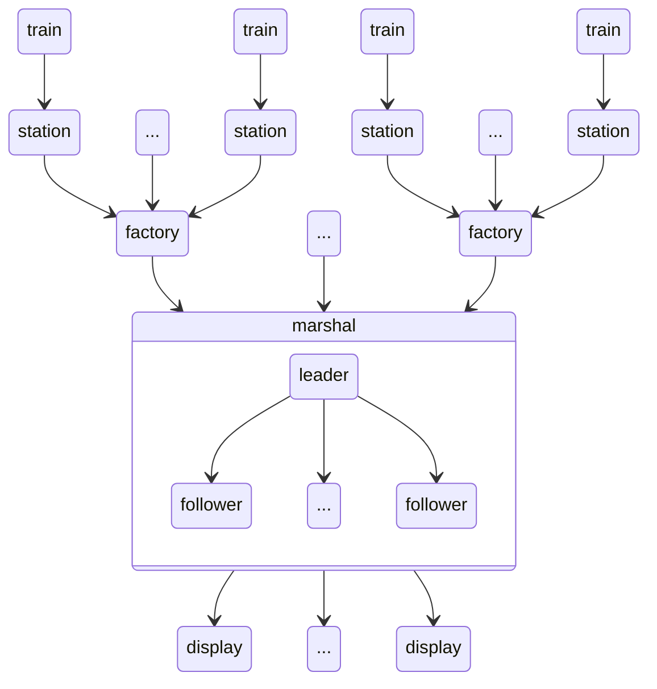
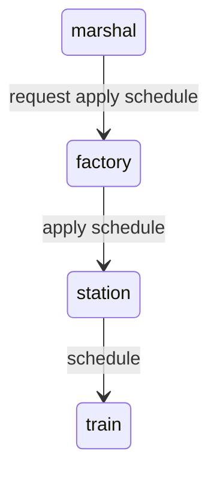
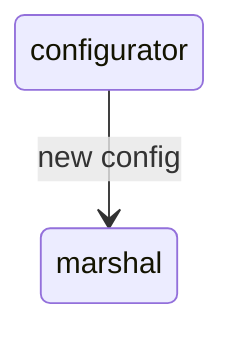

# Data flow

This page is partitioned into information flow and request flow.

## Information flow

System state:

```mermaid
stateDiagram
    train_1_1: train
    train_1_1 --> station_1_1
    train_1_n: train
    train_1_n --> station_1_n

    station_1_1: station
    station_1_1 --> factory_1
    station_1_ddd: ...
    station_1_ddd --> factory_1
    station_1_n: station
    station_1_n --> factory_1

    factory_1: factory
    factory_1 --> marshal

    factory_ddd: ...
    factory_ddd --> marshal

    train_m_1: train
    train_m_1 --> station_m_1
    train_m_n: train
    train_m_n --> station_m_n

    station_m_1: station
    station_m_1 --> factory_m
    station_m_ddd: ...
    station_m_ddd --> factory_m
    station_m_n: station
    station_m_n --> factory_m

    factory_m: factory
    factory_m --> marshal

    state marshal {
        leader
        leader --> follower_1
        leader --> follower_ddd
        leader --> follower_n
        follower_1: follower
        follower_ddd: ...
        follower_n: follower
    }
    marshal --> display_1
    display_1: display
    marshal --> display_ddd
    display_ddd: ...
    marshal --> display_n
    display_n: display
```

## Request flow

Train schedule requests:

```mermaid
stateDiagram
    marshal --> factory: request apply schedule
    factory --> station: apply schedule
    station --> train: schedule
```

Config application requests:

```mermaid
stateDiagram
    configurator --> marshal: new config
```
