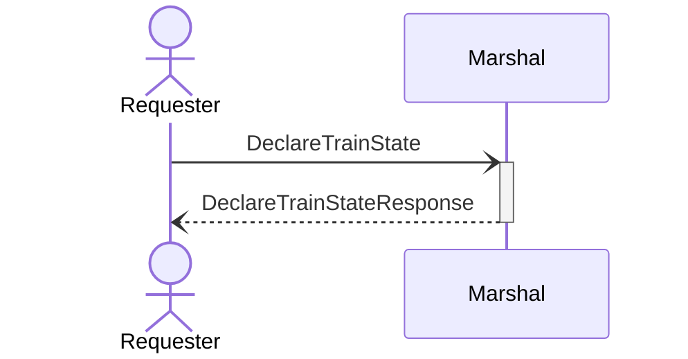
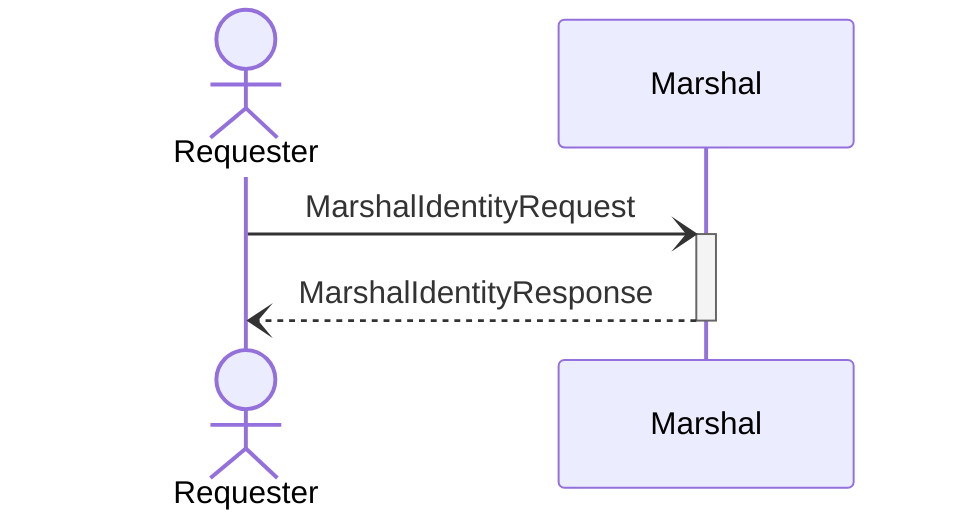

# Public protocols

The following network interactions with `ox` are supported for external programs.

## `DeclareTrainState`

Types involved:

- [`DeclareTrainState`](./types.html#declaretrainstate)
- [`DeclareTrainStateResponse`](./types.html#declaretrainstateresponse)

## `MarshalIdentityRequest`

<!-- TODO(kcza): separate MarshalIdentityRequest and FactoryIdentityRequest to hide the latter -->

Types involved:

- [`MarshalIdentityRequest`](./types.html#marshalidentityrequest)
- [`MarshalIdentityResponse`](./types.html#marshalidentityresponse)
