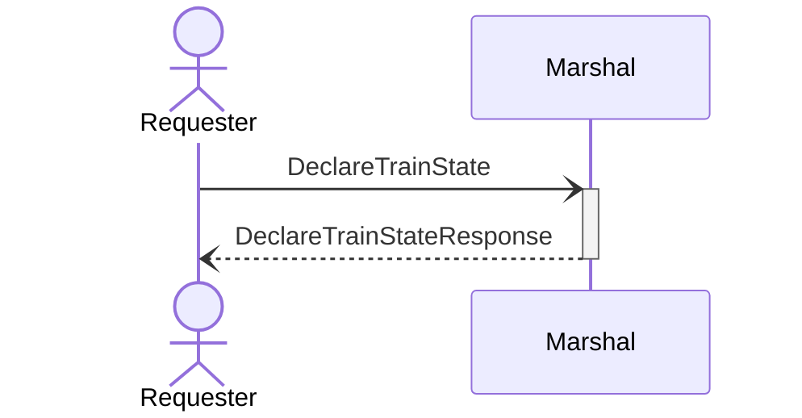
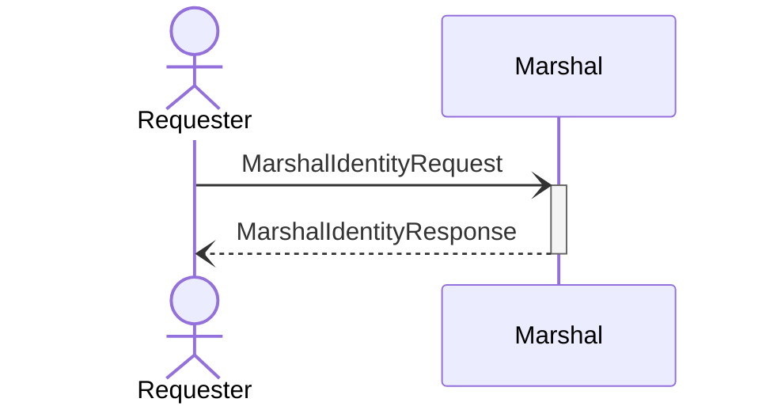

# Public protocols

The following network interactions with `ox` are supported for external programs.

## `DeclareTrainState`

## `MarshalIdentityRequest`

<!-- TODO(kcza): separate MarshalIdentityRequest and FactoryIdentityRequest to hide the latter -->

