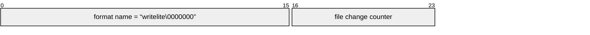

# Writelite

A writelite file is segmented into pages of 4096B.
There are two types of pages:

- File header page

## File header

The file header is stored in page 0. It contains:

1. The name of the file format.
   This is a constant `writelite` followed by padding `0` bytes
2. The version of the file format.
   For now, this is always equal to `1`
3. The file version.
   When a change is written, this value is changed.
4.

Entry IDs have a fixed length of 16 bits

- Header:
  - Format name
  - Size of file in pages
  - File change counter
  - User version
  - Offset of free-list page
  - Offset of mapping page start
  - Page size
  - The writelite version
  - Reserve the remainder of the page for future use
- Free list
  - Checksum
  - Next page index (or 0)
- Map data page
  - Checksum
  - Index of next page in map (or 0, must be zero if not first page)
  - Index of next page in sequence (or 0)
  - Length (< page size - page header size)
  - Raw data for the remainder

